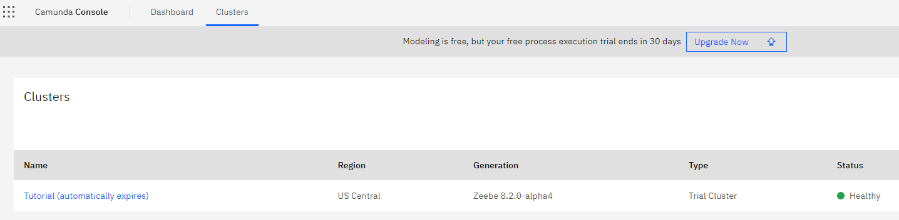
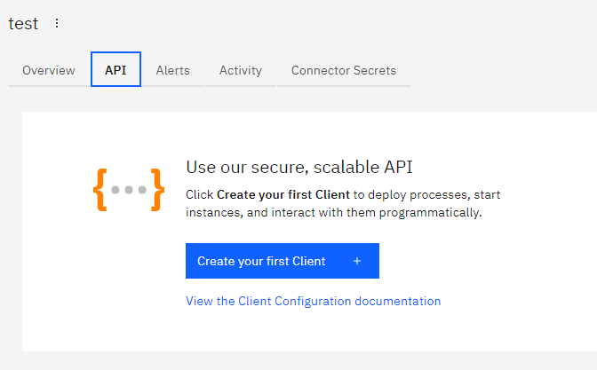
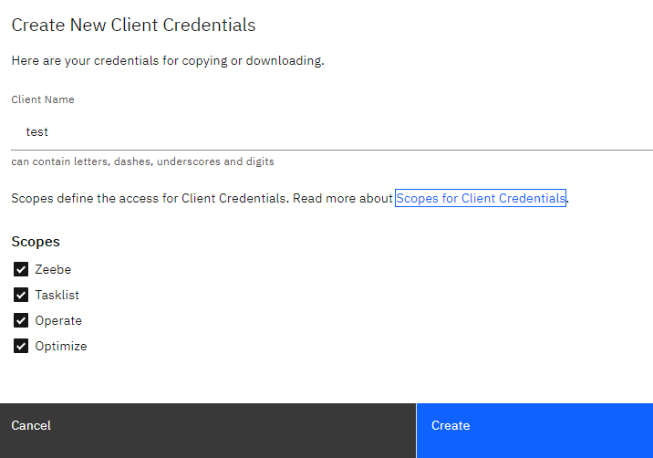
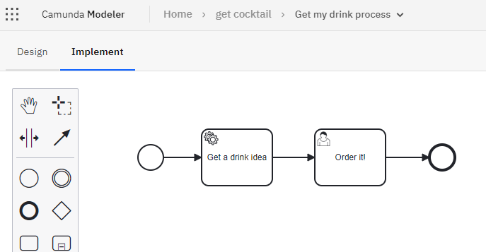
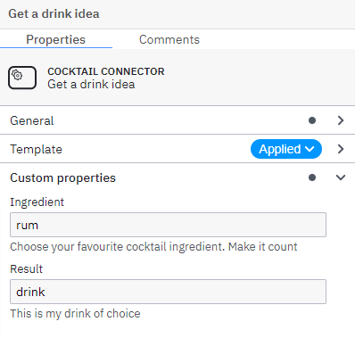

# Cocktail API Camunda 8 Connector

A Camunda 8 Connector to find the best cocktail ever!

Welcome to Camunda's Platform 8 custom connector exercise! In this workshop you will learn to:
* setup Camunda 8
* setup connector development kit
* develop your own connector and run it in runtime evnironment

**To structure this course we are going to split it into 6 exercises:**
1. Create an API for our cluster
2. Create a Connector template
3. Use the Connector template in a model
4. Setup Connector SDK and implement Connector function
5. Running the connector
6. Find out what is the best cocktail!

## 🚀 Getting started: Let's get C8 trial
Get started with Camunda Platform 8 by creating a Camunda Platform 8 SaaS trial.

https://camunda.com/get-started/

# 🎓Exercises
## Exercise 1: Create an API for our cluster
To be able to connect to our C8 cluster, we will have to expose an API. Later on we will use it to connect our 
local zeebe worker instance with the custom connector to the cluster.
#### a) Go to Clusters tab and select your cluster

#### b) Go to the API section on create your first client
You can also refer to this article when setting up client connection credentials (https://docs.camunda.io/docs/guides/setup-client-connection-credentials/)

Good job! You just configured an API client for your cluster!

## Exercise 2: Create a Connector template
Now let's head to the modeler. If you just created your C8 instance, then probably you will
have to start with creating a new project. Once you do, let's create a connector template.

The first step in creating your custom connector is to create a connector template.
The connector template is the definition of the custom modeling element that users can place into models to use your custom connector.
We’re going to create a new connector template and deploy it into the Web Modeler in Camunda Platform 8 SaaS.

https://docs.camunda.io/docs/components/connectors/custom-built-connectors/connector-sdk/#connector-template -> This documentation describes creating a connector template, and gives an example of the schema that is used

If you want to, you can just go ahead to the `/element-templates` directory and copy-paste the existing template.

## Exercise 3: Use the Connector template in a model
Now that our connector template is ready and published, we can go ahead and use it in our process definition.

Remember to fill in the properties accordingly to your needs.

## Exercise 4: Setup Connector SDK and implement Connector function
The next step is to implement the connector functionality. 

The Connector SDK provides the framework for implementing a connector function. The connector function
is an environment agnostic implementation, which means that we can deploy it in a number of ways – as a
Zeebe worker, or using a connector bridge as a Lambda function. 

We are going to run our connector in the Job Worker Connector Runtime.
https://github.com/camunda/connector-sdk/tree/main/runtime-util

To make the implementation easier, you can always start with repository template provided by Camunda.
https://github.com/camunda/connector-template

This way you can just clone it locally and customize it according to your needs.

You can also go to `/exercises` and copy the body of the connector from `Exercise4.txt`.

## Exercise 5: Running the connector
Our connector needs to run in a connector runtime. The connector runtime invokes our code in 
response to available work.

We will use the Connector SDK’s Job Worker Connector Runtime. This runtime starts a job 
worker that wraps our connector’s function, invoking it when the worker receives a job 
from the engine.

There are several options for integrating our connector with the runtime environment. 
Including the runtime in our connector as a maven dependency and then explicitly wrapping 
our connector function is one option. This method couples our connector with the runtime 
environment.

During this exercise I would like you to paste the environmental variables in to the `./resources/zeebe.web.app.properties`
and then start the application.

## Exercise 6: Find out what is the best cocktail!
Now we are ready to go!

Deploy and run your process instance, find out what is your chose cocktail!

